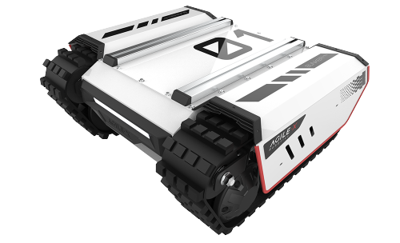

==================
AgileX BUNKER MINI
==================

The AgileX BUNKER MINI is compact, off road tracked mobile robot chassis built for challenging and
narrow working environments. With an impressive IP67 rating, it can effectively operate in sand,
dust, and water. Benefiting from a compact size, a strong off road climbing ability, and a zero
radius turn, tt offers industry developers a better platform to deploy robotic applications such as
waterway surveying and mapping, mineral exploration, pipeline inspection, security, autonomous
transportation, and more. Open-source packages are available for C++ and ROS for secondary
development.

What's Here
===========

*   :doc:`getting_started` - These guides will walk you through the setup process for your BUNKER
    MINI.
*   :doc:`operation` - These guides will details concepts related to the operation of the BUNKER
    MINI.
*   :doc:`specifications` - Contains specification information for the BUNKER MINI and related
    hardware.
*   :doc:`downloads` - Downloadable content related to the BUNKER MINI.

Table of Contents:
==================

.. toctree::
    :maxdepth: 2
    :titlesonly:

    getting_started.rst
    operation.rst
    specifications.rst
    downloads.rst
