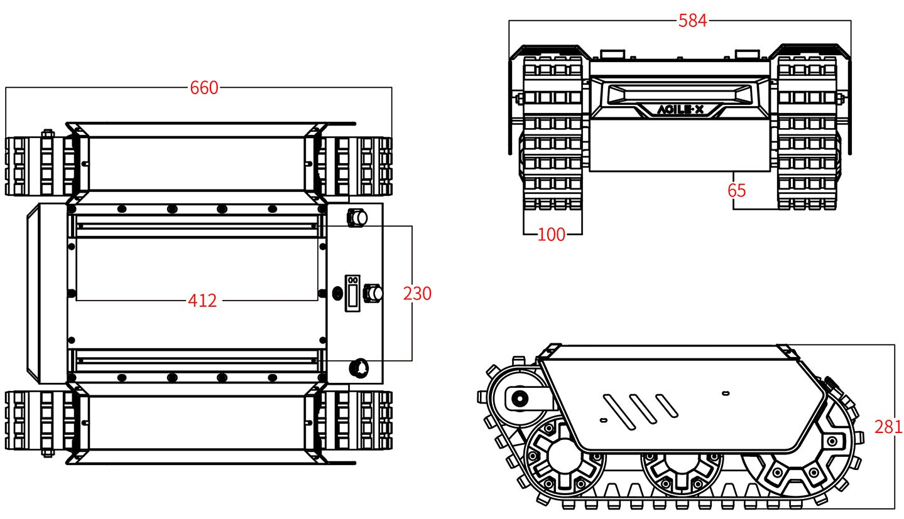

==============
Specifications
==============

.. contents::
    :local:

Bill of Materials
=================

*   1x BUNKER MINI Robot Body
*   1x Battery Charger (220VAC)
*   1x Aviation Plug Male 4-Pin
*   1x USB-to-CAN Module
*   1x RC Transmitter

Specifications Overview
=======================

.. list-table::
    :align: center

    * - Dimensions
      - 660mm x 584mm x 281mm
    * - Weight
      - 54.8kg
    * - Payload
      - 35kg
    * - Operating Temperature
      - -20°C to 60°C
    * - IP Rating
      - IP67
    * - Battery
      - 24V30Ah
    * - Charging Time
      - 3 to 4 hours
    * - Communication
      - CAN Interface
    * - Maximum Speed (No Load)
      - 1.5m/s
    * - Maximum Climbable Obstacle Height (No Load)
      - 115mm
    * - Maximum Climbable Slope (No Load)
      - 30°
    * - Minimum Ground Clearance
      - 65mm

Major Dimensions
================

